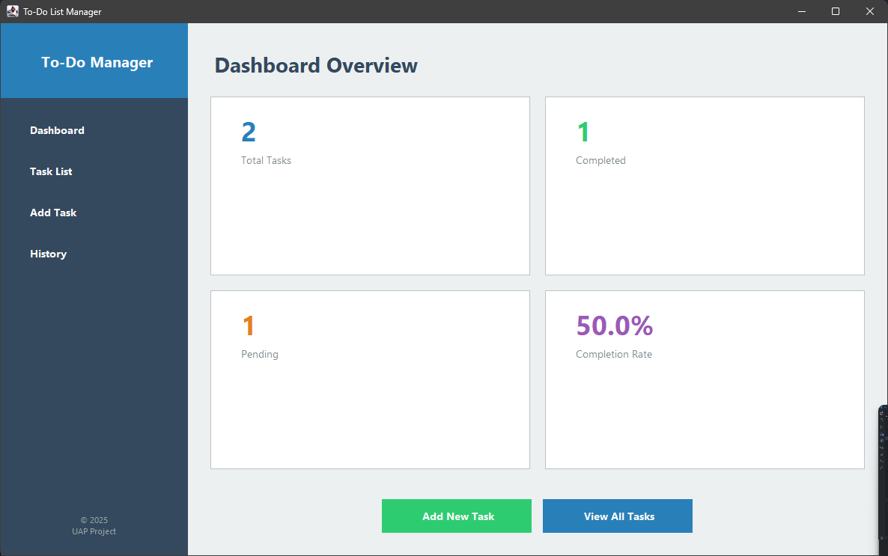
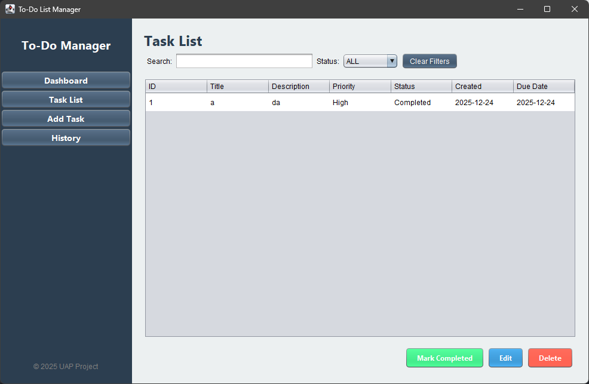
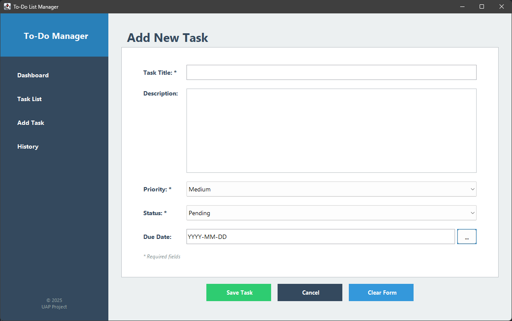
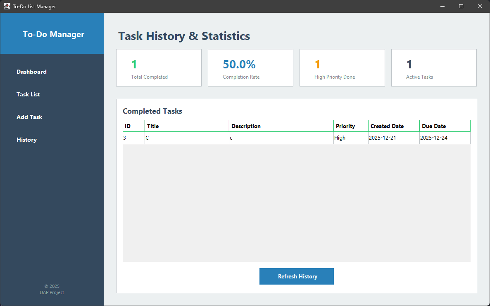

# 📋 To-Do List Manager

> **Modern Task Management Application built with Java Swing**

<div align="center">


**UAP Pemrograman Lanjut 2025** | Universitas Muhammadiyah Malang

[Features](#-features) • [Installation](#-installation) • [Usage](#-usage) • [Documentation](#-documentation)

</div>

---

## 📸 Preview


*Dashboard with real-time statistics and quick actions.*


*Interactive task list with sorting and filtering.*


>User-friendly form for adding and editing tasks.


>Visual representation of completed tasks and statistics.

---

## ✨ Features

- **Modern GUI** with Java Swing
- **Data Persistence** using CSV files
- **Real-time Search** and filtering
- **Statistics Dashboard** with visualizations
- **Complete CRUD** functionality
- **Comprehensive Error Handling**

---

## 🚀 Installation

### Prerequisites

- Java JDK 11 or higher
- Maven 3.6+
- An IDE of your choice (IntelliJ IDEA, Eclipse, VS Code, etc.)

### Build & Run

```bash
# Clone or download the project
cd demo

# Compile the project
mvn clean compile

# Run the application
mvn exec:java -Dexec.mainClass="com.uap.ToDoListApp"

# (Optional) Package the application
mvn package
```

---

## 📝 Usage

1. **Run the application** using one of the methods above.
2. **Add a new task** via the "Add Task" menu.
3. **View all tasks** in the "Task List" section.
4. **Edit a task** by double-clicking it or using the Edit button.
5. **Delete a task** using the Delete button.
6. **View history** in the "History" menu.

**For detailed instructions:** Refer to the [USER_GUIDE.md](demo/USER_GUIDE.md)

---

## 📚 Documentation

This project comes with comprehensive documentation:

### 🎯 Start Here
- **[INDEX.md](demo/INDEX.md)** - Navigation guide for the documentation
- **[QUICK_START.md](demo/QUICK_START.md)** - How to run the application

### 📖 Main Documentation
- **[README_APP.md](demo/README_APP.md)** - Complete technical documentation
- **[USER_GUIDE.md](demo/USER_GUIDE.md)** - User manual (in Bahasa Indonesia)

### ✅ UAP Requirements
- **[DOKUMENTASI_KETENTUAN.md](demo/DOKUMENTASI_KETENTUAN.md)** - Compliance with UAP requirements
- **[PROJECT_SUMMARY.md](demo/PROJECT_SUMMARY.md)** - Project summary

---

## 🎯 Main Features

### 1️⃣ Dashboard
- Real-time statistics (Total, Completed, Pending, Completion Rate)
- Quick actions for fast navigation
- Visual cards with icons

### 2️⃣ Task List
- Interactive table with sorting
- Real-time search
- Multi-filter (Status + Priority)
- Double-click to edit

### 3️⃣ Add/Edit Task
- Input form with validation
- Dropdowns for Priority & Status
- Error handling with dialog
- Dual mode (Add/Edit)

### 4️⃣ History & Statistics
- History of completed tasks
- Tracking of completion rate
- Statistics based on priority
- Visual representation

---

## 💻 Technologies Used

- **Java 21** (compatible with 11+)
- **Java Swing** for GUI
- **Maven** for build management
- **CSV** for data storage
- **LocalDate** for date handling
- **ArrayList & Stream API** for data manipulation

---

## 📁 Project Structure

```
demo/
├── src/main/java/com/uap/
│   ├── ToDoListApp.java       # Main entry point
│   ├── MainDashboard.java     # Dashboard & Navigation
│   ├── TaskListPanel.java     # Task list view
│   ├── TaskInputPanel.java    # Add/Edit form
│   ├── HistoryPanel.java      # History & stats
│   ├── Task.java              # Model class
│   ├── TaskManager.java       # Business logic
│   └── FileHandler.java       # File operations
│
├── Documentation/
│   ├── INDEX.md               # 📚 Navigation guide
│   ├── QUICK_START.md         # 🚀 Installation
│   ├── README_APP.md          # 📖 Full docs
│   ├── USER_GUIDE.md          # 📱 User manual
│   ├── DOKUMENTASI_KETENTUAN.md # ✅ Requirements
│   └── PROJECT_SUMMARY.md     # 📊 Summary
│
└── pom.xml                    # Maven config
```

---

## ✅ Compliance with UAP Requirements

| Requirement | Status | Implementation |
|-------------|--------|----------------|
| **A. Java Swing GUI** | ✅ | 100% Swing components used |
| **B. 4+ Pages** | ✅ | Dashboard, List, Input, History |
| **C. Complete CRUD** | ✅ | Create, Read, Update, Delete operations |
| **D. File Handling** | ✅ | CSV format with auto-save feature |
| **E. Sorting** | ✅ | Multi-column sorting in tables |
| **F. Searching** | ✅ | Real-time search and filtering |
| **G. LocalDate Usage** | ✅ | Proper date tracking implemented |
| **H. ArrayList Usage** | ✅ | Dynamic data storage with ArrayList |
| **I. Comparator Usage** | ✅ | Custom sorting implemented with Comparator |
| **J. Exception Handling** | ✅ | Comprehensive try-catch blocks for error handling |

**Overall Compliance: 100% ✅**

---

## 🎨 Screenshots

### Dashboard
- Modern interface with statistics cards
- Color-coded information for quick insights
- Quick action buttons for fast navigation

### Task List
- Sortable and filterable table
- Real-time search functionality
- Filter by status and priority

### Input Form
- Clean and user-friendly form layout
- Input validation with user-friendly error messages
- Dropdowns for easy selection of priority and status

### History
- Overview of completed tasks
- Visual statistics for performance tracking
- Progress tracking over time

---

## 🔧 Development

### Prerequisites
- Java JDK 11 or higher
- Maven 3.6+
- IDE (IntelliJ IDEA / Eclipse / VS Code)

### Build & Run
```bash
# Clone or extract project
cd demo

# Compile
mvn clean compile

# Run
mvn exec:java -Dexec.mainClass="com.uap.ToDoListApp"

# Package (optional)
mvn package
```

---

## 🎓 Learning Outcomes

Proyek ini mengimplementasikan konsep dari **Modul 1-6**:

1. **Java Basics & OOP** - Classes, inheritance, encapsulation
2. **Collections** - ArrayList, generics, Stream API
3. **Exception Handling** - Try-catch, validation
4. **File I/O** - CSV operations, data persistence
5. **GUI Development** - Swing components, event handling
6. **Design Patterns** - MVC, Observer, Strategy

---

## 🏆 Key Features Breakdown

### Data Management
- ✅ Auto-increment ID
- ✅ Input validation
- ✅ Data persistence
- ✅ Error recovery

### User Interface
- ✅ Modern design
- ✅ Intuitive navigation
- ✅ Visual feedback
- ✅ Responsive layout

### Advanced Features
- ✅ Real-time search
- ✅ Multi-filter
- ✅ Table sorting
- ✅ Statistics dashboard
- ✅ Completion tracking

---

## 📞 Support

**Dokumentasi Lengkap:** [demo/INDEX.md](demo/INDEX.md)

**Quick Start:** [demo/QUICK_START.md](demo/QUICK_START.md)

**User Guide:** [demo/USER_GUIDE.md](demo/USER_GUIDE.md)

---

## 📄 License

Project ini dibuat untuk keperluan akademik (UAP Pemrograman Lanjut 2025).

---

## 🎉 Status Proyek

**Status: COMPLETE ✅**

✅ All source files created
✅ CRUD operations working
✅ GUI implemented
✅ File handling functional
✅ Exception handling added
✅ Documentation complete
✅ Testing performed
✅ Ready for submission

---

**🚀 Ready to use! Happy Task Managing!**

*UAP Pemrograman Lanjut 2025 - Universitas Muhammadiyah Malang*

**Link Repository:** [https://github.com/rehanamrllh/PL_UAP](https://github.com/rehanamrllh/PL_UAP)

---
