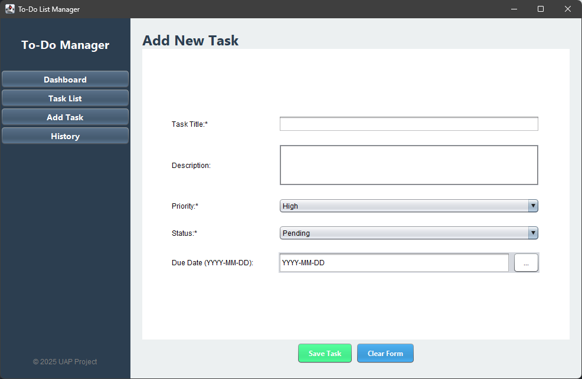

# 📋 To-Do List Manager

> **Modern Task Management Application built with Java Swing**

<div align="center">


**UAP Pemrograman Lanjut 2025** | Universitas Muhammadiyah Malang

[Features](#-features) • [Installation](#-installation) • [Usage](#-usage) • [Project Structure](#-project-structure)

</div>

---

## 📸 Preview


*Dashboard with real-time statistics and quick actions.*


*Interactive task list with sorting and filtering.*


>User-friendly form for adding and editing tasks.


>Visual representation of completed tasks and statistics.

---

## ✨ Features

- **Modern GUI** with Java Swing
- **Data Persistence** using CSV files
- **Real-time Search** and filtering
- **Statistics Dashboard** with visualizations
- **Complete CRUD** functionality
- **Auto-increment numeric ID** (1,2,3,...) for tasks
- **LocalDate handling** (created date + due date)
- **Simple Date Picker** (spinner-based)
- **Comprehensive Error Handling**

---

## 🚀 Installation

### Prerequisites

- Java JDK 11 or higher
- Maven 3.6+
- An IDE of your choice (IntelliJ IDEA, Eclipse, VS Code, etc.)

### Build & Run

```bash
# Clone or download the project
cd demo

# Compile the project
mvn clean compile

# Run the application (recommended)
mvn -DskipTests package
java -jar target/demo-1.0-SNAPSHOT.jar

# Alternative (VS Code / direct run)
# Main class: com.uap.app.ToDoApp
# Compatibility launcher: com.uap.ToDoApp

# (Optional) Package the application
mvn package
```

---

## 📝 Usage

1. **Run the application** using one of the methods above.
2. **Add a new task** via the "Add Task" menu.
3. **View all tasks** in the "Task List" section.
4. **Edit a task** using the Edit button.
5. **Delete a task** using the Delete button.
6. **View history** in the "History" menu.

Data is stored in a CSV file named `tasks_data.csv` in the current working directory.
If you want to reset the app data, delete that file.

---

## 🎯 Main Features

### 1️⃣ Dashboard
- Real-time statistics (Total, Completed, Pending, Completion Rate)
- Quick actions for fast navigation
- Visual cards with icons

### 2️⃣ Task List
- Interactive table with sorting
- Real-time search
- Filter by status (ALL / Pending / Completed)
- Edit/Delete/Complete actions via buttons

### 3️⃣ Add/Edit Task
- Input form with validation
- Dropdowns for Priority & Status
- Error handling with dialog
- Dual mode (Add/Edit)

### 4️⃣ History & Statistics
- History of completed tasks
- Tracking of completion rate
- Statistics based on priority
- Visual representation

---

## 💻 Technologies Used

- **Java** (tested with JDK 21; source/target configured by Maven)
- **Java Swing** for GUI
- **Maven** for build management
- **CSV** for data storage
- **LocalDate** for date handling
- **ArrayList & Stream API** for data manipulation

---

## 📁 Project Structure

```
demo/
├── src/main/java/com/uap/
│   └── ToDoApp.java                 # Compatibility launcher (calls com.uap.app.ToDoApp)
├── src/main/java/com/uap/app/
│   └── ToDoApp.java                 # Main entry point (JFrame + navigation)
├── src/main/java/com/uap/data/
│   └── DataManager.java             # CSV load/save + ID generation
├── src/main/java/com/uap/model/
│   └── Task.java                    # Model (LocalDate created/due)
├── src/main/java/com/uap/ui/
│   ├── LocalDatePickerField.java    # Simplified date picker (spinner)
│   ├── UIColors.java                # Theme colors
│   └── UIUtils.java                 # UI helpers
└── src/main/java/com/uap/ui/panels/
	├── DashboardPanel.java
	├── TaskListPanel.java
	├── AddTaskPanel.java
	└── HistoryPanel.java

└── pom.xml                    # Maven config
```

---

### Dashboard
- Modern interface with statistics cards
- Color-coded information for quick insights
- Quick action buttons for fast navigation

### Task List
- Sortable and filterable table
- Real-time search functionality
- Filter by status and priority

### Input Form
- Clean and user-friendly form layout
- Input validation with user-friendly error messages
- Dropdowns for easy selection of priority and status

### History
- Overview of completed tasks
- Visual statistics for performance tracking
- Progress tracking over time

---

## 🔧 Development

### Prerequisites
- Java JDK 11 or higher
- Maven 3.6+
- IDE (IntelliJ IDEA / Eclipse / VS Code)

### Build & Run
```bash
# Clone or extract project
cd demo

# Compile
mvn clean compile

# Run (jar)
mvn -DskipTests package
java -jar target/demo-1.0-SNAPSHOT.jar

# Package (optional)
mvn package
```

---

## 🎓 Learning Outcomes

Proyek ini mengimplementasikan konsep dari **Modul 1-6**:

1. **Java Basics & OOP** - Classes, inheritance, encapsulation
2. **Collections** - ArrayList, generics, Stream API
3. **Exception Handling** - Try-catch, validation
4. **File I/O** - CSV operations, data persistence
5. **GUI Development** - Swing components, event handling
6. **Design Patterns** - MVC, Observer, Strategy


---

## 📄 License

Project ini dibuat untuk keperluan akademik (UAP Pemrograman Lanjut 2025).

---


**🚀 Ready to use! Happy Task Managing!**

*UAP Pemrograman Lanjut 2025 - Universitas Muhammadiyah Malang*

**Link Repository:** [https://github.com/rehanamrllh/PL_UAP](https://github.com/rehanamrllh/PL_UAP)

---
